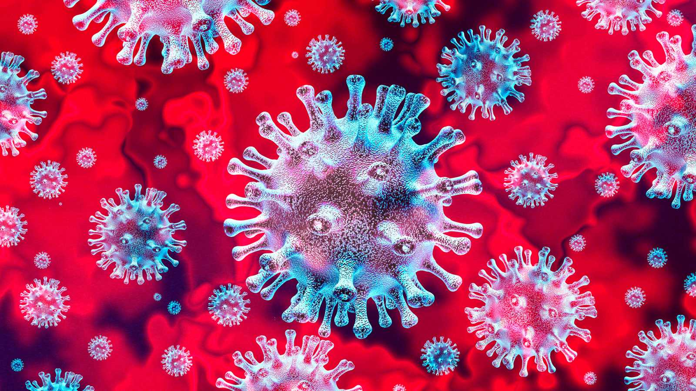

# Project Statistical Analysis

Karla y Mar

*Data Part Time Barcelona Dic 2019*

## Content

**Índice**   
1. [Project Description](#id1)
2. [Dataset](#id2)
3. [Workflow](#id3)
3. [Results](#id4)

## Project Description

The following notebook contains interactive dashboards with the information of COVID-19 cases worldwide.

## Dataset

Data information it's provided by an api conection request: https://covid19api.com/. This API refresh every day its information from the official information source https://github.com/CSSEGISandData/COVID-19 from the Center for Systems Science and Engineering at John Hopkins University

URL: https://api.covid19api.com/all
Contains all the aggregated data by countries

### Field description:
* <CODE>Country</CODE>: country/region name conforming to WHO (will be updated).
* <CODE>Province</CODE>: China - province name; US/Canada/Australia/ - city name, state/province name
* <CODE>Others</CODE>:  name of the event (e.g., "Diamond Princess" cruise ship); other countries - blank.
* <CODE>Lat</CODE>: Latitude at Province/State level - China, US, Canada, Australia; Country level - other countries. All points shown on the map are based on geographic centroids, and are not representative of a specific address, building or any location at a spatial scale finer than a province/state.
* <CODE>Lon</CODE>: Longitude at Province/State level - China, US, Canada, Australia; Country level - other countries. All points shown on the map are based on geographic centroids, and are not representative of a specific address, building or any location at a spatial scale finer than a province/state.
* <CODE>Date</CODE>: YYYY/MM/DDTHH:mm:ssZ format ISO_8601.
* <CODE>Cases</CODE>: Number of cases
* <CODE>Status</CODE>:
    * <CODE>Confirmed</CODE>: the number of confirmed cases. For Hubei Province: from Feb 13 (GMT +8), we report both clinically diagnosed and lab-confirmed cases. For lab-confirmed cases only (Before Feb 17), please refer to who_covid_19_situation_reports. For Italy, diagnosis standard might be changed since Feb 27 to "slow the growth of new case numbers." (Source)
    * <CODE>Deaths</CODE>: the number of deaths.
    * <CODE>Recovered</CODE>: the number of recovered cases.
    
The dashboards pressent in the final part a little insight of the data obtained.

## Workflow

1. Explore data and understand what the fields mean.

2. Examine the relationships between the sales price and other features in the dataset. Use data visualization techniques to help you gain intuitive understanding of the relationships.

3. Make informed guess on which features should be investigated in depth.

4. Data cleaning & manipulation. Apply the following techniques as appropriate:
    * Adjust skewed data distribution.
    * Remove columns with high proportion of missing values.
    * Remove records with missing values.
    * Feature reduction.
    * Convert categorical data to numerical.
    
5. Compute field relationship scores with the chosen statistical model.

6. Present your findings in statistical summary and/or data visualizations.

## Results

